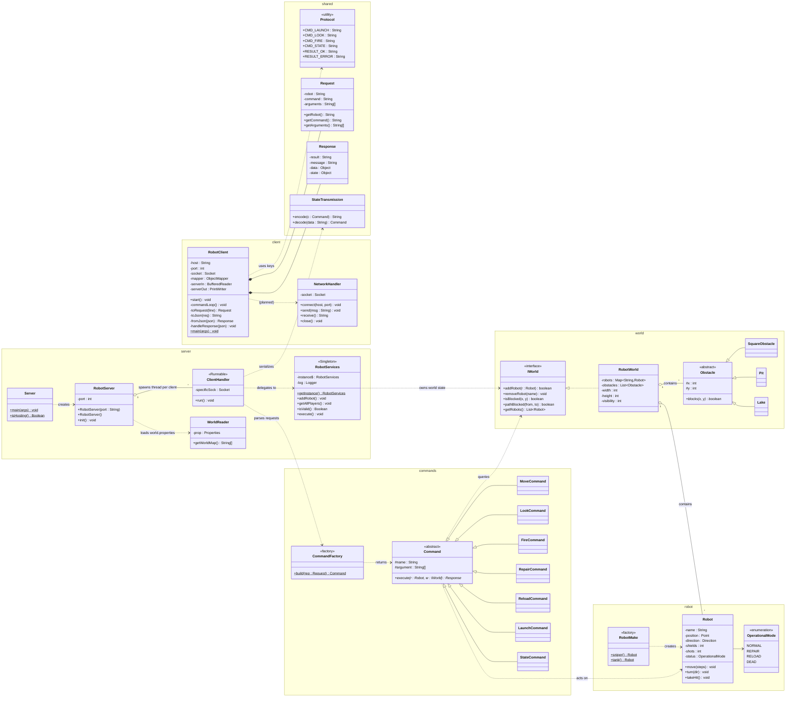
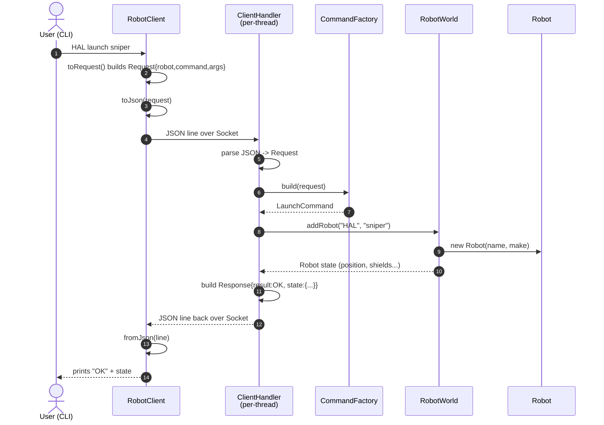
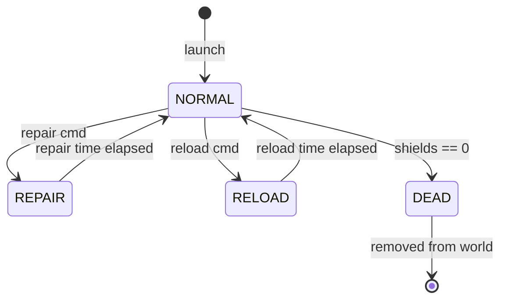
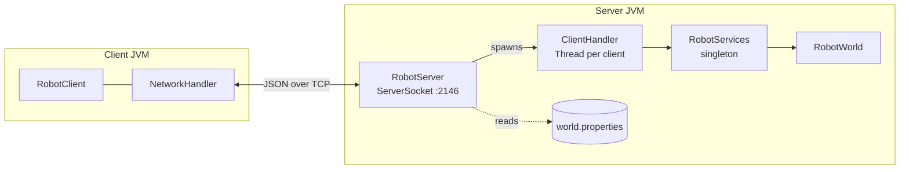

# Robot Worlds — UML Diagrams

> **Legend.** Solid boxes = classes that exist in the repo today (even if stubbed).
> Dashed/italic notes = planned for Iterations 2–3 per the README.
> `<<interface>>`, `<<abstract>>`, `<<enumeration>>`, `<<Runnable>>`, `<<Singleton>>` are stereotypes.

---

## 1. Class Diagram — Whole System



---

## 2. Sequence Diagram — `launch` command (Iteration 1 → 3)



---

## 3. Sequence Diagram — `fire` command (Iteration 3)

```mermaid
sequenceDiagram
    autonumber
    actor U as User
    participant C as RobotClient
    participant H as ClientHandler
    participant Cmd as FireCommand
    participant W as RobotWorld
    participant R1 as Attacker Robot
    participant R2 as Victim Robot

    U->>C: HAL fire
    C->>H: {"robot":"HAL","command":"fire"}
    H->>Cmd: execute(R1, W)
    Cmd->>W: robotsInLineOfSight(R1)
    W-->>Cmd: [R2]
    Cmd->>R2: takeHit()
    R2->>R2: shields-- ; if 0 -> status=DEAD
    Cmd-->>H: Response{result:OK,<br/>data:{distance, hit:"R2"}}
    H-->>C: JSON
    C-->>U: "Hit R2 at distance 3"
```

---

## 4. State Diagram — Robot lifecycle



---

## 5. Component View



---

## Status snapshot — what's real vs stub

| Class | State today |
|---|---|
| `Server`, `RobotServer`, `ClientHandler` | implemented (basic echo loop) |
| `RobotClient` | implemented (Request/Response inner classes, JSON via Jackson) |
| `Command` | abstract class skeleton only — `execute()` not yet defined |
| `LookCommand`, `MoveCommand` | stubs / one-line placeholders |
| `Robot`, `IWorld`, `RobotWorld` | empty files (comment-only) |
| `OperationalMode` | enum complete |
| `WorldReader`, `RobotServices` | scaffolded |
| `Protocol`, `NetworkHandler` | placeholder comments — Iteration 1 work |
| `Obstacle`, `RobotMake`, `CommandFactory`, `StateCommand`, `FireCommand`, etc. | not yet created — Iteration 2/3 |
